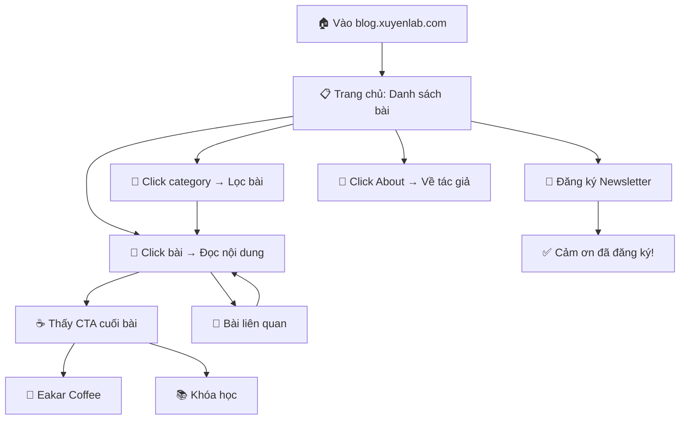
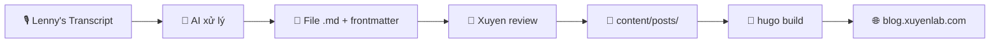

# Xuyen's Blog — Detailed Spec

## 1. Executive Summary

Blog tĩnh bằng Hugo tại blog.xuyenlab.com. Việt hóa insight từ Lenny's Podcast, kết hợp quan điểm cá nhân của Xuyen. Target: người lao động VN 27-45 tuổi, domain expert nhưng low-code, cần tầm nhìn + framework + động lực về AI/công nghệ.

**Scope MVP:** Blog tĩnh, About Me, CTA (Eakar Coffee + Khóa học), Newsletter, 5-10 bài launch.
**Không làm:** Đăng nhập, comment, multi-language, search nâng cao, auto-publish pipeline.

---

## 2. User Stories

| # | Story | Priority |
|---|-------|----------|
| US1 | Là người đọc, tôi muốn xem danh sách bài viết mới nhất để chọn bài quan tâm | P0 |
| US2 | Là người đọc, tôi muốn đọc bài viết đầy đủ với format dễ đọc | P0 |
| US3 | Là người đọc, tôi muốn xem bài liên quan để đọc thêm | P1 |
| US4 | Là người đọc, tôi muốn đăng ký newsletter để nhận bài mới | P1 |
| US5 | Là người đọc, tôi muốn xem bài theo category để tìm chủ đề quan tâm | P1 |
| US6 | Là người đọc, tôi muốn biết về tác giả qua trang About | P2 |
| US7 | Là Xuyen, tôi muốn pipeline tạo bài từ transcript để tiết kiệm thời gian | P1 |
| US8 | Là Xuyen, tôi muốn CTA cuối bài để promote Eakar Coffee / Khóa học | P0 |

---

## 3. Database Design

### ERD (Static file-based)
```
Posts (.md files)          Subscribers (JSON)
├── title                 ├── email
├── slug                  └── subscribed_date
├── summary
├── category ──────────── Categories (4 fixed)
├── tags[]                ├── ai-technology
├── thumbnail             ├── mindset
├── lenny_episode         ├── framework
├── cta_type              └── career
├── published_date
└── status
```

### Categories (Fixed 4)
| Slug | Display |
|------|---------|
| `ai-technology` | AI & Công nghệ |
| `mindset` | Mindset & Tư duy |
| `framework` | Framework & Chiến lược |
| `career` | Career & Sự nghiệp |

### CTA Types
| Type | Action |
|------|--------|
| `coffee` | Banner → Eakar Coffee |
| `course` | Banner → Khóa học AI/Vibe-coding |

---

## 4. Logic Flowchart



### Content Pipeline Flow


---

## 5. API Contract

Không có API — static site. Tất cả content serve từ HTML files.

Duy nhất Newsletter form submit ra bên ngoài:
- **MVP:** POST → Formspree / Google Forms (3rd party)
- **Sau này:** Self-hosted endpoint

---

## 6. UI Components

| Component | Vị trí | Mô tả |
|-----------|--------|--------|
| `nav` | Mọi trang, top | Logo + Home + About + Categories |
| `post-card` | Trang chủ, category pages | Thumbnail + title + summary + date + category |
| `cta-banner` | Cuối bài viết | Coffee hoặc Course banner |
| `related-posts` | Cuối bài viết | 2-3 bài cùng category |
| `newsletter-form` | Trang chủ + cuối bài | Input email + Subscribe button |
| `footer` | Mọi trang, bottom | Social links + copyright |

---

## 7. Scheduled Tasks

Không có scheduled tasks cho MVP. Content pipeline chạy manual.

---

## 8. Third-party Integrations

| Service | Mục đích | Phase |
|---------|----------|-------|
| Google Fonts | Typography (Inter/Noto Sans) | 2 |
| Formspree hoặc Google Forms | Newsletter subscribe | 5 |
| Cloudflare Tunnel | HTTPS + domain routing | 7 |

---

## 9. Hidden Requirements (Đã phát hiện)

| Requirement | Xử lý |
|-------------|--------|
| Bài chưa có thumbnail | Hiện `default-thumbnail.jpg` |
| Email đăng ký trùng | Báo "Bạn đã đăng ký rồi" |
| Bài draft | Không hiện trên trang chủ |
| Không có bài liên quan cùng category | Hiện bài mới nhất |
| Frontmatter thiếu trường | Hugo báo lỗi build, không crash |
| Mobile | Responsive 320px → 1440px |

---

## 10. Tech Stack

| Layer | Tech | Lý do |
|-------|------|-------|
| SSG | Hugo | Nhanh, Markdown-native, simple |
| Hosting | Home server | Đã có sẵn, self-hosted |
| Domain | blog.xuyenlab.com | Subdomain xuyenlab.com |
| HTTPS | Cloudflare Tunnel | Đã dùng cho projects khác |
| CSS | Vanilla CSS | Tối giản, không dependency |
| Newsletter | 3rd party (MVP) | Nhanh gọn, upgrade sau |
| Content | Markdown + frontmatter | Hugo native format |

---

## 11. Build Checklist

- [ ] Phase 1: Hugo project chạy được
- [ ] Phase 2: Trang chủ hiện bài mẫu
- [ ] Phase 3: Đọc bài + CTA + related posts
- [ ] Phase 4: About + nav + footer + categories
- [ ] Phase 5: Newsletter + responsive + edge cases
- [ ] Phase 6: 5-10 bài viết sẵn sàng
- [ ] Phase 7: Live tại blog.xuyenlab.com
